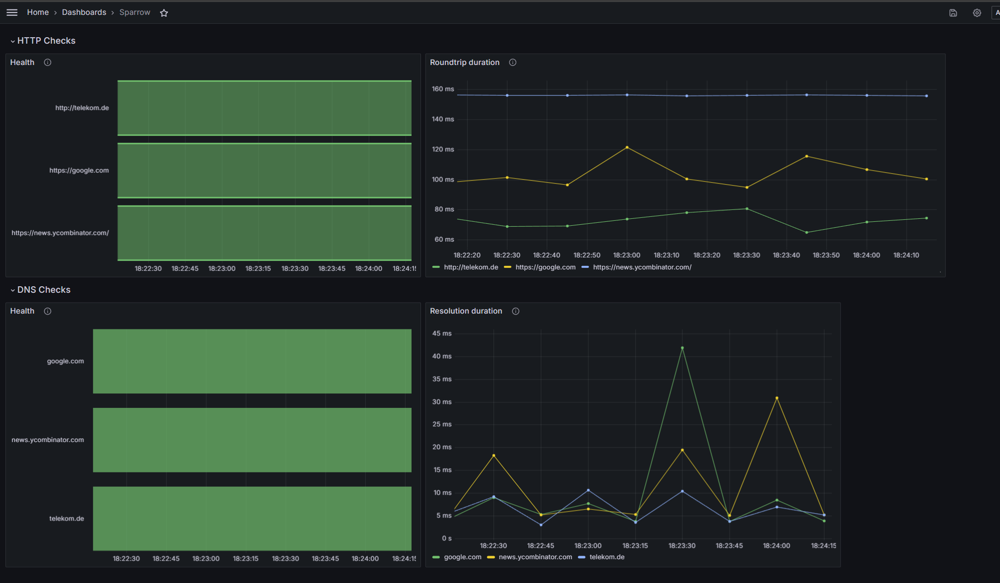

<!--
SPDX-FileCopyrightText: 2025 Deutsche Telekom IT GmbH

SPDX-License-Identifier: CC-BY-4.0
-->

# Observability

Sparrow exposes metrics, traces, and supports Grafana
dashboards for monitoring.

## Prometheus Metrics

Sparrow serves a `/metrics` endpoint with runtime and
per-check metrics. See each check's documentation for its
specific metrics:

- [Health metrics](checks/health.md#metrics)
- [Latency metrics](checks/latency.md#metrics)
- [DNS metrics](checks/dns.md#metrics)
- [Traceroute metrics](checks/traceroute.md#prometheus-metrics)

### Instance Info Metric

- `sparrow_instance_info` (Gauge, value always 1) — Instance
  metadata. Labels: `instance_name` plus any user-defined
  [metadata keys](configuration.md#instance-metadata-optional).

Example PromQL:

```promql
# All instances with their metadata
sparrow_instance_info

# Filter by team
sparrow_instance_info{team_name="platform-team"}

# Join check metrics with ownership
sparrow_health_up
  * on(instance) group_left(team_name, team_email, platform)
  sparrow_instance_info
```

### Prometheus Scrape Configuration

```yaml
scrape_configs:
  - job_name: 'sparrow'
    static_configs:
      - targets: ['<sparrow_instance_address>:8080']
```

## Traces

Some checks — notably
[traceroute](checks/traceroute.md#metrics-and-observability)
— produce structured, variable-depth data that Prometheus
metrics cannot efficiently represent.

Sparrow supports pushing this data as OTLP trace spans
to any compatible backend (Jaeger, Grafana Tempo, etc.).
See the [traceroute observability rationale][traceroute-rationale]
for details on why both pull (Prometheus) and push (OTLP)
channels exist.

Configure trace export in the
[startup configuration](configuration.md#example-startup-configuration):

| Field                    | Type     | Description                          |
| ------------------------ | -------- | ------------------------------------ |
| `telemetry.enabled`      | `bool`   | Enable telemetry (default: `false`). |
| `telemetry.exporter`     | `string` | `grpc`, `http`, `stdout`, or `noop`. |
| `telemetry.url`          | `string` | Collector address.                   |
| `telemetry.token`        | `string` | Bearer token for authentication.     |
| `telemetry.tls.enabled`  | `bool`   | Enable TLS.                          |
| `telemetry.tls.certPath` | `string` | Custom TLS certificate path.         |

The `stdout` exporter prints traces to the console for
debugging. The `noop` exporter disables telemetry.

Since [OTLP](https://opentelemetry.io/docs/specs/otlp/) is a
standard protocol, you can use any compatible collector.

[traceroute-rationale]: checks/traceroute.md#metrics-and-observability

## Grafana Dashboards

A sample dashboard is available in the `examples` directory.
Import it following the
[Grafana documentation][grafana-import].



[grafana-import]: https://grafana.com/docs/grafana/latest/reference/export_import/

## See Also

- [API](api.md) — HTTP endpoints
- [Configuration](configuration.md) — telemetry and metadata
  setup
